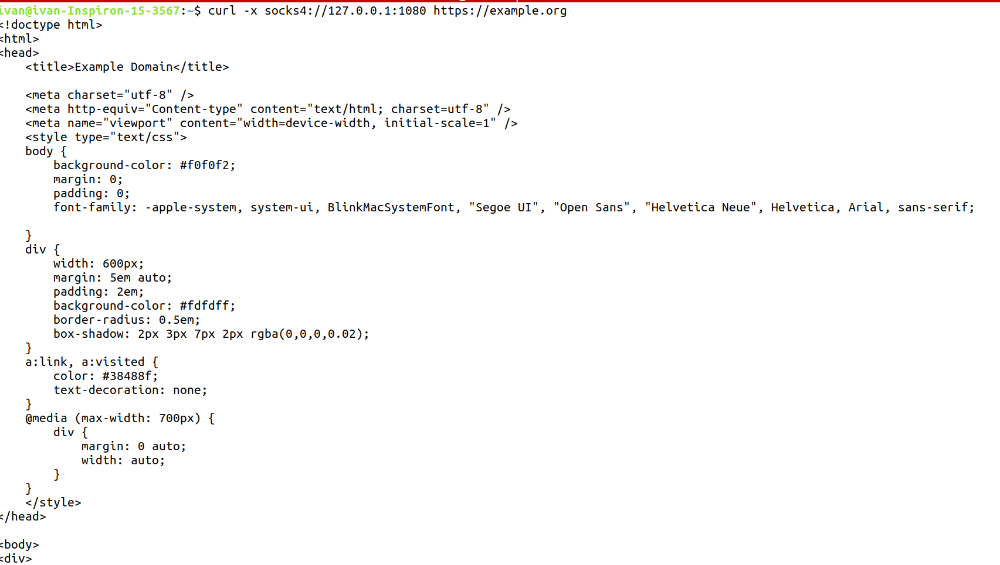
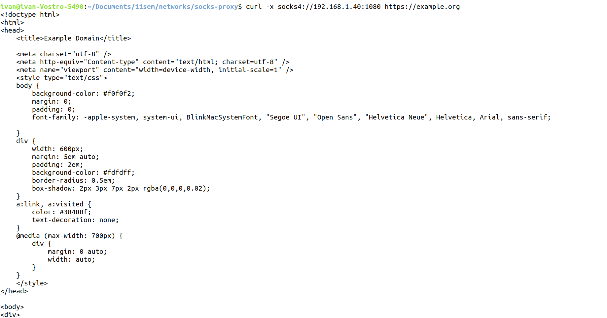

# SOCKS4 прокси-сервер на Python3

- [Запуск сервера](#Запуск-сервера)
- [Тестирование](#Тестирование)

## Запуск сервера


- Простой запуск при помощи интерпретатора
```
./run.sh python
```

- Запуск в контейнере
```
./run.sh start
```

- Остановка контейнера
```
./run.sh stop
```

## Тестирование
```
curl -x socks4://address_of_machine:1080 https://example.org
```

Сделаем запрос на машине с доступом в интернет, 
и на которой запущен прокси-сервер



Сделаем запрос на машине без доступа в интернет, 
но с доступом к машине, имеющий доступ во внешний интернет 

